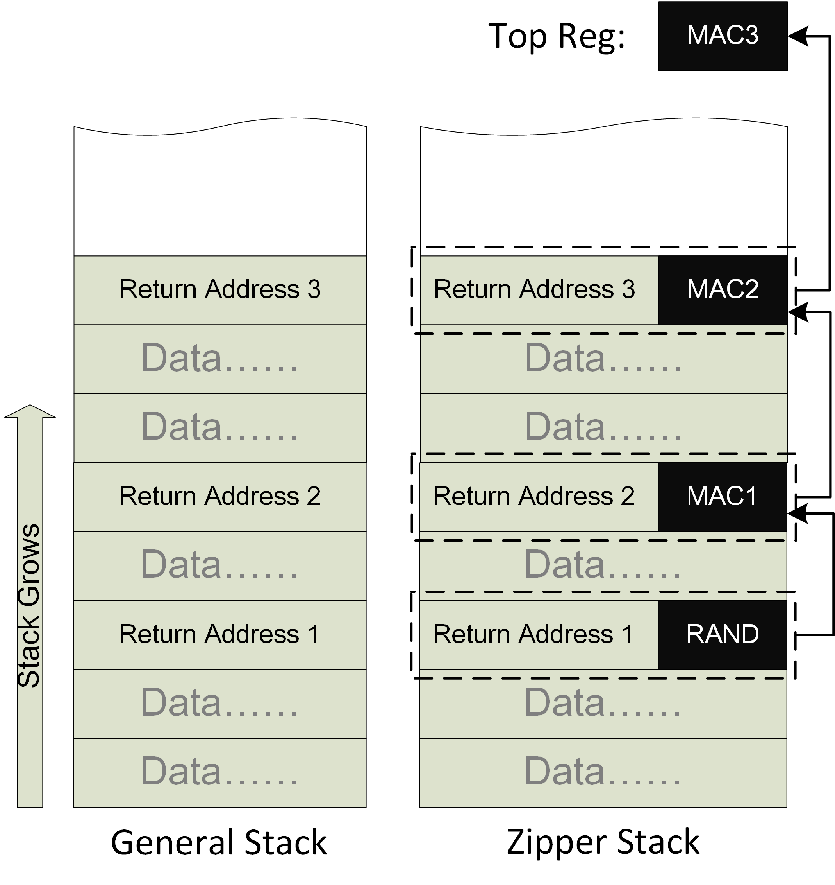
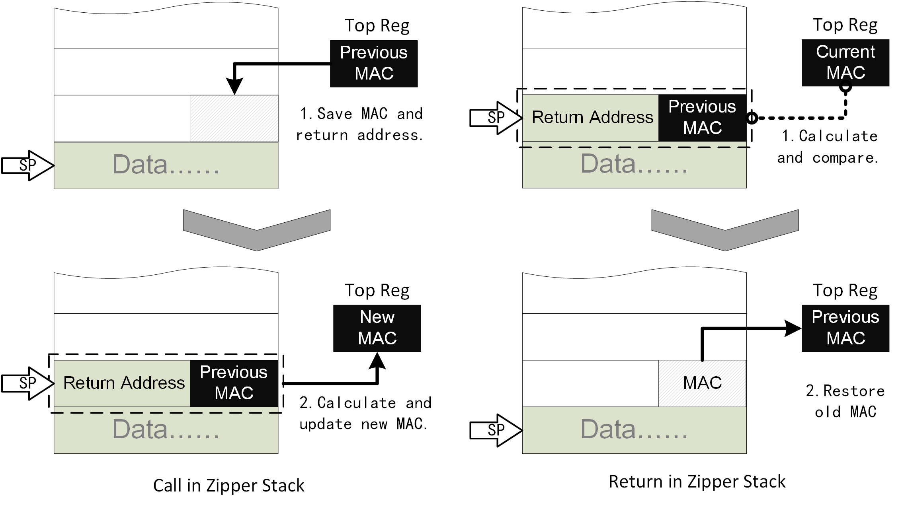

# Zipper Stack工作介绍和反思总结

## 论文

经过漫长的等待，Zipper Stack这篇文章终于被ESORICS 2020接收了，可以在自己的博客里做一个简单的介绍和总结了。

[预印版本](https://arxiv.org/abs/1902.00888)

后续正式出版我会更新链接。

## 声明

欢迎感兴趣的研究者与我联系讨论，最近也在找工作，有相关的岗位欢迎联系。不过该设计已经申请专利（若干项），因此如果希望使用还是请联系讨论授权事宜。

## 简介

Zipper Stack主要是用于保护内存中返回地址的一种新型安全机制。这可以阻止目前最常见的ROP攻击，也可以使得栈溢出漏洞无法直接通过返回地址挟持控制流。在学术中我们可以称之为后向的控制流完整性保护（CFI）。

### 背景

目前后向控制流完整性保护主要有两个技术路线：

#### 影子栈

影子栈的思路主要是讲返回地址在内存中再备份一份，并在返回时对比栈中的地址和备份是否一致。这种思路的主要优点是比较简单，性能开销也比较低。缺点就是十分依赖于影子栈本身的安全性。因为在内存攻击中，经常假设攻击者可以任意的读写多数内存的，如何保护影子栈成为了关键：

+ 使用ASLR来隐藏影子栈：这种方式比较简单，但其实安全性很低，因为针对ASLR的去随机化攻击可以说是一抓一大把了。
+ 使用内存隔离：要借助一些其他的硬件机制。
+ Intel CET中使用一个全新的页属性：这种安全性要等实际部署才能评估了，因为DEP也是使用页属性保护，但是绕过的方式也很多。

这个思路下还有一些类似的设计，比如SafeStack等等。

#### MAC验证

MAC验证可以应用于多数的代码指针，当然也包括返回地址。目前商用CPU中有计划的例子就是ARMv8.3中的Pointer Authentication（PA），简单来说就是为每个指针生成一个MAC，并在使用时验证MAC是否正确。这种保护主要依赖于秘钥的安全性。这种思路的有点也是比较简单，但是缺点也很明显：

+ 使用MAC意味着复杂的计算，代码指针尤其是返回地址在应用程序中的使用非常频繁，因此无法承受过于复杂的MAC计算，只能设计轻量级的快速MAC计算模块。
+ 重放攻击：攻击者可以复用内存内已知的代码指针和其正确的MAC。PA中预留了一个modifier用来给相同的指针生成不同的MAC，但如何选取modifier依然是一个麻烦的问题。
  
### Zipper Stack

Zipper Stack是我们新提出的基于链式MAC来保护程序中所有返回地址的安全机制。简要的示意图如下： 

简单来说，我们把所有的MAC值放到一个链中，可以看做是每个区块只包含一个返回地址的区块链。每个MAC的输入除了Key以外，还包括返回地址和与这个返回地址绑定的MAC，而这个MAC并不与当前的返回地址一同存储，而是存储在下一个返回地址的旁边。而最新的返回地址和其MAC生成的新MAC存放在一个特殊的寄存器中（Top寄存器）。

这个看起来复杂的内存布局如何在程序执行call和return时操作呢？实际上非常简单：

除了正常的栈操作外：

+ Call时将Top寄存器的值随返回地址一同压栈，且更新Top寄存器。
+ Return时先验证MAC是否正确，然后用栈上弹出的MAC值更新Top寄存器。

直觉上，这似乎太简单了。因为很多这种链式结构都需要记录指针（上一个或者下一个）。因为调用和返回实在太过频繁，因此记录指针是几乎不可以容忍的开销。好在有了Top寄存器，我们其实并不需要显式的维护这个链式结构。

#### 优势

Zipper Stack相对于之前设计的优势还是非常明显的：

+ 相对于影子栈：
  + 不需要额外的影子栈内存的保护（这也是所有基于MAC的方法的优势）
+ 相对于普通MAC：
  + 不必担心秘钥泄露：在论文中有详细的阐述，即使攻击者得知当前的秘钥，攻击者也无法修改Top寄存器。唯一可能的途径是构造哈希碰撞，而这几乎不可能：
    + 每个配件构造一次
    + 每次程序运行需要重新构造
    + 每个配件构造时有一定概率不存在可能的碰撞，5个配件此概率大于90%
  + 天然抵抗复用攻击，相同的地址再次使用时MAC不同：我们不再需要想方设法构造modifier了。
  + 速度快：因为哈希计算和访存/寄存器更新可以并行，因此我们可以容忍更加复杂，消耗更多周期的MAC算法。一个示意图如下。
  + 

总结来说，我们使用了比PA技术更低的运行时开销达到了更高的安全性：
+ 相同MAC算法Zipper Stack更快，相同速度Zipper Stack可以使用更复杂的MAC。
+ 我们可以容忍秘钥泄露，并且暴力破解的难度更高。

#### 缺点：

Zipper Stack也有一定的缺点：依赖于栈的FILO序列，因此当这个序列被破坏时需要一定的修复。也就是异常处理需要更加复杂。下面是三种不同方式的异常处理：

+ Zipper Stack：备份并恢复Top寄存器。
+ 影子栈：备份并恢复影子栈指针。
+ MAC：不需要任何操作。

在论文的评审中，评委还是比较看重这里造成的复杂度和安全性的。因为一般异常处理的现场需要在内存中保护，而Top寄存器是需要假设攻击者无法改写的。因此我在这里设计上下文切换也是需要MAC保护的。实际上我并不认为这是个明显的缺点：

+ 上下文切换造成的安全隐患本身就非常多，这并不是Zipper Stack引入的。
+ 熟悉攻击的都知道，影子栈指针虽然看起来人畜无害，但是实际上能控制指针约等于能控制数据，所以影子栈指针也面临基本一样的问题。并且影子栈并不存在其他保护措施（MAC），因此更加危险。

在博客中我就仅仅介绍思想和设计了，更多细节请参考论文，有兴趣和以为的欢迎联系我进一步讨论。

## IDEA来源

这个idea看起来比较像是从区块链来的，然而其实最初的idea来源主要是思考如何能够提高直接MAC保护。最初我认为如果一个MAC的Key是不断变化的，那么攻击难度应该是增加了很多。最初的idea就是使用上一次的MAC作为下一次的Key来使用，这样可以使Key滚动。但是实际上并没有增加信息量，因此我也直觉上认为这不应该提高攻击难度。仔细思考了之后发现确实不行。后来逐渐修改，形成了最后的设计。

## 写在最后

这篇论文其实从2018年就基本成型了，拖了两年，主要有以下的原因：一是我比较贪心，希望能中安全的顶会，因此一直不甘心，最后中了个ESORICS也算不亏了。二是家庭变故导致一年没什么认真工作的机会。三是第一次发论文经验不足，不仅最初写的惨不忍睹（在此要感谢陈恺老师的指导，非常关键）而且最初对标的是影子栈，思路是错误的。如果当初直接调研到PA，估计行文会更加流畅，也不至于被人直接用ARM PA直接做一个类似的版本抢结果了。评委提醒我有其他人跟我一样的核心思想（他们先发了一个DAC的Work in Progress）的时候还是很崩溃的，早知道不发arxiv了o(╥﹏╥)o。

另一点感悟还是不要妄自菲薄，当初刚形成这个idea的时候很担心以后也就没啥更好的idea了，因此重视程度过高。实际上这篇文章刚中不就，我的其他工作也被接收了，还是更好的期刊（这个是CCF-B类，而后面是A类）。所以还是要眼光长远，不要拘泥于眼前的得失。

不论如何，这个工作算是我第一个作品了，现在尘埃落定我还是比较欣慰了。ESORICS也是比较合适的归宿了。