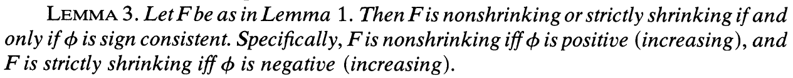

# Huffman树算法的推广

## 动机

目前的工作中出现了一种这样的需求：

+ 需要将一些有不同频率的符号进行二进制前缀编码。需要越频繁的出现的符号编码越短，越少出现的符号编码越长。

这与基础Huffman编码的需求基本接近。但是具体到细节上，Huffman编码的最优解是使得总cost `G=Sum(i){p(i)*l(i)} `最低，即最后总长度最底，而我们的需求中，总cost为`G=Sum(i){p(i)*2^(l(i))}`,即每个编码每次出现的cost不是其长度`l`而是`2^l`。这显然与Huffman树的原始需求不用，那么我们应该选用什么样的算法呢？

最终找到的Huffman树的推广算法中文资料中并没有找到相关的介绍。在此记录和分享一下。

## 相关论文

类似的需求的讨论在不同的领域内有不同的论文，例如类似的以幂次为cost的Huffman树构造需求出现在一些避免buffer overflow的情况中。但是经过几篇论文追踪后，发现了一个可以将Huffman树推广到准线性的一个方法和证明。

参考论文：Parker, Jr D S. Conditions for optimality of the Huffman algorithm[J]. SIAM Journal on Computing, 1980, 9(3): 470-489.

## 问题和算法描述

假设有n+1个节点，有不同的权重：

可以经过n次合并，合并到一棵二叉树中。

定义符号为：

并定义：

+ U 为权重的空间，为R+。
+ F 为权重组合函数，F:UU-->U 
+ G 为树权重函数(Tree cose function) 

那么**Huffman算法**可以描述为，即：
给定一个权重组合函数F，每次将两个最小权重的可合并节点合并起来，知道仅剩一个可合并节点。

可以看出，经典Huffman算法就是`F=x+y`且`G=sum`的Huffman算法：

## 准线性权重组合函数（F）

首先定义函数`φ`性质：

可定义`F`性质：

最后一条准线性意味着F可以写作此形式，当φ是可逆的。

例如，原始Huffman树即为`λ=1，φ(x)=x`则`F(x,y)=x+y`

为了后续证明，我们需要F：

+ 为连续的
+ 必须将U*U影射到U中
+ 是path-length monotone的（第二个性质定义）

其中第一项要求`φ`是连续的，而且因为它是可逆的，也就必然是严格单调的。
第二项和第三项由以下引理可以保证：（论文中有证明）

即需要满足`λ≥1`且`φ`是无界的。

有了这些条件，可以得到如下性质：

论文中引理2为这四个性质和引理1的条件是等价的。

之后有引理3：

即若F满足引理1，则如果`φ`是恒号的，F是nonshrinking或者是strictly shrinking。且F是nonshrnking当且仅当φ是正的，反之亦然。

继续定义：若一棵二叉树的每个节点的权重是由F函数从子节点计算而来的，则称之为F-tree。
一个权重组合函数是**Huffman单调的**如果：

+ 交换一个F-tree的任意两个等深的节点，其根的权重相等。
+ 交换一个F-tree的任意两个不等深的节点，若（交换前）较深的节点权重低于较浅的节点的权重，则根的权重交换后升高。反之亦然。

定理1：若F是Huffman单调的，则Huffman算法得出的树的根节点的权重最小。

证明见论文。这个证明的方法其实与经典的证明方法类似：任意换两个节点，则根权重必然增加。这是经典Huffman树证明的一个推广。

定理2：F是Huffman单调的当且仅当F满足`QL3`和`QL4`

由两个引理和两个定理得到推论1：F是Huffman单调的，当且仅当F满足是准线性的并且满足引理1。

至此，最关键的所有定理和推论都结束了：
若我们可以将带权重的二叉树的权重函数F写成

即准线性，其中，`λ≥1`，`φ`是连续严格递增的无界的函数。或者用`QL1~4`来验证F是否满足条件，若满足，则可以使用Huffman算法来生成一个根权重最小的树。

## 论文中还有什么

论文中继续扩展了这些定理和结论，包括多叉树（每个父节点的子节点数目更多）和很多满足这些条件的应用场景的讨论，就包含了我所需要的场景，在此不再赘述，有兴趣的可以详细读论文原文。

## 如何使用这个算法

我们的需求非常简单，可以写作`F(x,y)=2(x+y)`即`λ=2 φ(x)=x`即可，这样每层的权重累加到上一层时就乘以一次2，根节点的权重为最终的cost。满足以上条件，以此为函数构造Huffman树并得到编码即可。

在我们的需求中`G(W(T))`等于最后根节点的权重，G的定义只是为了方便更多应用场景的拓展，如果我们根节点的权重已经是总的cost，就可以忽略了。

## 算法示例

https://github.com/Readm/huffmanX

这个代码也可以直接使用任意的权重函数F。欢迎测试和使用。