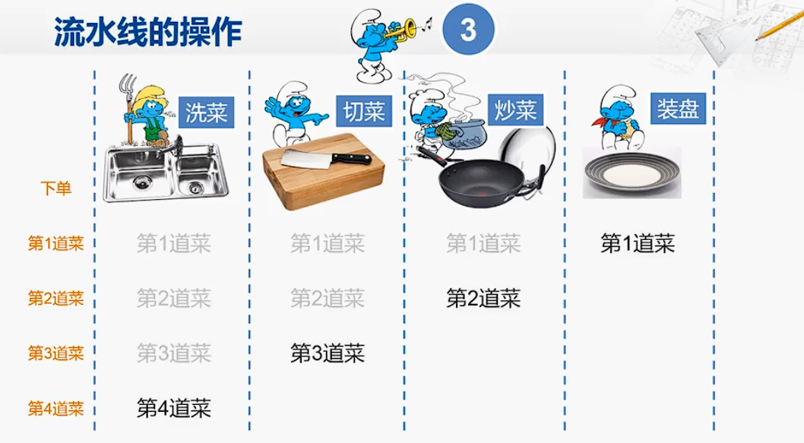

# 计算系统基础知识

这一章节其实是非常有挑战性的，因为我们似乎可以发现许多安全问题的逻辑是一致的，但是又没有办法系统的将它们总结出来（如果能像数学理论一样公理化将是多么方便）。因此本章的内容可能是会逐步更新的。

### 贯穿系列全局的比喻

那我们不妨通过引言中说到的方式来开始，我们这里开启一个全系列通用的比喻，用这个比喻来描述整个计算系统，并介绍其安全逻辑。本章的内容相信很多读者完全不需要这些比喻就可以理解，但是如果你对安全逻辑不熟悉，请不要跳过这些比喻，这会影响我们后面如何把安全逻辑通过简单的比喻解释清楚。

我非常喜欢把CPU流水线比喻成炒菜的比喻。
（参见计算机组成-陆俊林 | [Bilibili](https://www.bilibili.com/video/BV1VE411o7nx/?p=33&share_source=copy_web&vd_source=1e7b2a00ea6e3563c7f705e2269fe564&t=263) | [原出处](http://www.chinesemooc.org/mooc/4392)）

我们不妨继续这个比喻开始，读者可以先忽略流水线的部分。我们可以将CPU看做一个厨房，它接受一个点单系统的订单（读取指令），然后根据不同的订单制作不同的菜（执行指令），这些订单来自于一个客户（软件）。

!!! note
    下文中，我们使用这种Note标记来声明对应的全局类比关系

    概念  | 类比
    ------------- | -------------
    CPU | 厨房（包含会做菜的厨师）
    软件 | 一个使用厨房制作菜品的客户
    指令 | 软件的不同订单

接下来我们解释CPU现在有的权限等级（用户态，内核态，Hypervisor，可信态）是如何出现的：

### 首先我们发展出了操作系统OS：

除去非常原始或者非常简单的计算机，他们只有一个单一的软件。现代的计算机通常需要各种不同的软件，也就是说，我们的厨房需要服务若干个客户，因此他们经常是轮流占用这个厨房来生产订单（即CPU的时分复用）。但是不同的客户的存放仓库（例如Memory）应该是互相隔离的，他们肯定不希望自己的菜被别人随便拿走或者被塞一些不想要的菜进来。因此最开始我们需要一个特权的客户（操作系统）可以在厨房中做任何事情，包括分配不同的仓库位置给不同的普通客户。普通的客户使用厨房时，只有他自己所拥有的仓库可以使用，其他客户的厨房它无权访问（即内存隔离）。一些敏感的材料也只能把特权客户喊回来让他代为拿取（即系统调用）。

!!! note
    下文中，我们使用这种Note标记来声明对应的全局类比关系

    概念  | 类比
    ------------- | -------------
    时分复用CPU             | 不同的客户轮流使用厨房
    Memory（和其他共享资源） | 厨房的仓库
    用户进程                | 普通客户，可以使用部分仓库资源
    内核                    | 拥有特权的客户，可以使用所有厨房仓库资源
    系统调用                | 普通用户需要自身不可使用的资源时，需要叫特权客户代为操作

可以看到，这里**本意上，其实并没有认为不同的普通客户之间有互相攻击的意图，我们仅仅是为了防止互相之间拿错东西也希望有个管理员来管理**。也就是说，OS对不同的用户态的资源隔离，其实并不是单纯为了安全才这么做，其实也是为了整个系统的健壮性，或者你可以认为是对应Safety的安全性。这部分的逻辑可以去学习**虚拟地址空间**这个概念。要知道如果没有这个的时候，所有的软件的内存需要互相之间协调简直是噩梦。好比一群客户公用一个厨房，但是调料和原料都需要互相之间君子协定来表明属于谁。即使你没有故意偷其他人的材料，也可能谁不小心把酱油倒进了你本来放醋的碗里，想想都崩溃。现在有了管理员，他每次把厨房交个你这个普通客户使用的时候，会先把其他人的东西收拾干净，然后恢复到你上次使用这个厨房的状态，简直不要太省心，好评！（自如合租做得到吗？？？）

但是实际上，这也**同时满足了部分安全需求**，即即使有的客户想去盗取其他客户的材料（一个恶意软件想窃取另一个软件的敏感数据），他也没有权限直接去拿取这些材料。

todo：

本书将分为以下几个部分：

+ 计算系统安全通用概念
+ 计算域间安全
+ 计算域内安全
+ 侧信道和故障输入安全
+ 特定领域安全