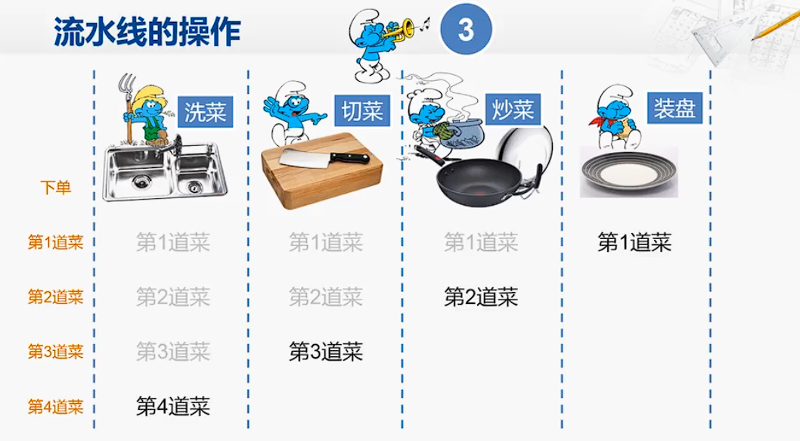

# 1.1 什么是CPU

这一章节其实是非常有挑战性的，因为我们似乎可以发现许多安全问题的逻辑是一致的，但是又没有办法系统地将它们总结出来（如果能像数学理论一样公理化将是多么方便）。因此本章的内容可能是会逐步更新的。

### 一个贯穿系列全局的比喻类比

我们首先要先从什么是CPU来讲起，为了抛去繁琐的定义和特定的架构名词。我们不妨通过引言中说到的方式来开始，我们这里开启一个全系列通用的比喻，用这个比喻来描述整个计算系统，并介绍其安全逻辑。本章的内容相信很多读者完全不需要这些比喻就可以理解，但是如果你对安全逻辑不熟悉，请不要跳过这些比喻，这会影响我们后面如何把安全逻辑通过简单的比喻解释清楚。

我非常喜欢把CPU流水线比喻成炒菜的比喻。
（参见计算机组成-陆俊林 | [Bilibili](https://www.bilibili.com/video/BV1VE411o7nx/?p=33&share_source=copy_web&vd_source=1e7b2a00ea6e3563c7f705e2269fe564&t=263) | [原出处](http://www.chinesemooc.org/mooc/4392)）

我们不妨继续这个比喻开始，读者可以先忽略流水线的部分。我们可以将CPU看做一个厨房，它接受一个点单系统的订单（读取指令），然后根据不同的订单制作不同的菜（执行指令），这些订单来自于一个客户（软件）。

!!! note
    下文中，我们使用这种Note标记来声明对应的全局类比关系

    概念  | 类比
    ------------- | -------------
    CPU | 厨房（包含会做菜的厨师）
    软件 | 一个使用厨房制作菜品的客户
    指令 | 软件的不同订单

接下来我们解释CPU现在有的权限等级（用户态，内核态，Hypervisor，可信态）是如何出现的：

### 操作系统OS：

除去非常原始或者非常简单的计算机，他们只有一个单一的软件。现代的计算机通常需要各种不同的软件，也就是说，我们的厨房需要服务若干个客户，因此他们经常是轮流占用这个厨房来生产订单（即CPU的时分复用）。但是不同的客户的存放仓库（例如Memory）应该是互相隔离的，他们肯定不希望自己的菜被别人随便拿走或者被塞一些不想要的菜进来。因此最开始我们需要一个特权的客户（操作系统）可以在厨房中做任何事情，包括分配不同的仓库位置给不同的普通客户。普通的客户使用厨房时，只有他自己所拥有的仓库可以使用，其他客户的厨房它无权访问（即内存隔离）。一些敏感的材料也只能把特权客户喊回来让他代为拿取（即系统调用）。

!!! note
    概念  | 类比
    ------------- | -------------
    时分复用CPU             | 不同的客户轮流使用厨房
    CPU状态                 | 厨房本身锅灶和厨具的状态
    Memory（和其他共享资源） | 厨房的仓库
    用户进程（APP）         | 普通客户，可以使用部分仓库资源
    内核                    | 拥有特权的客户，可以使用所有厨房仓库资源
    系统调用                | 普通用户需要自身不可使用的资源时，需要叫特权客户代为操作

可以看到，这里**本意上，其实并没有认为不同的普通客户之间有互相攻击的意图，我们仅仅是为了防止互相之间拿错东西也希望有个管理员来管理**。也就是说，OS对不同的用户态的资源隔离，其实并不是单纯为了安全才这么做，其实也是为了整个系统的健壮性，或者你可以认为是对应Safety的安全性。这部分的逻辑可以去学习**虚拟地址空间**这个概念。要知道如果没有这个的时候，所有的软件的内存需要互相之间协调简直是噩梦。好比一群客户公用一个厨房，但是调料和原料都需要互相之间君子协定来表明属于谁。即使你没有故意偷其他人的材料，也可能谁不小心把酱油倒进了你本来放醋的碗里，想想都崩溃。现在有了管理员，他每次把厨房交个你这个普通客户使用的时候，会先把其他人的东西收拾干净，然后恢复到你上次使用这个厨房的状态，简直不要太省心，好评！（自如合租做得到吗？？？）

但是实际上，这也**同时满足了部分安全需求**，即即使有的客户想去盗取其他客户的材料（一个恶意软件想窃取另一个软件的敏感数据），他也没有权限直接去拿取这些材料。

### Hypervisor：

再往后，CPU开始提供虚拟化支持可以支持多个系统。最常见的应用之一就是云服务商将虚拟机租给不同的客户。这就好像有一个万达商场，里面提供了很多个（32个）厨房，吸引不同的老板入驻。每个老板自己都是管理员。万达广场为了多赚钱，就会卖给多余32个老板厨房的使用权利，当有老板来使用厨房，他就选择一个空闲的厨房，布置成这个老板上次使用结束的状态，让这个老板可以像刚接着上次刚使用过的厨房一样继续使用这个厨房。比如周一三五，门口的店面给老板A，周二四六，门口的店面给老板B。管理员负责每天晚上记录他们厨房的状态，并且恢复到前一个老板的状态。

如果卖给了64个老板，那么这64个不同的使用权和他们的状态，就是所谓的`vCPU`（虚拟机）。当然，他们有可能会冲突，比如有40个老板同时要开张，那么万达广场只能暂时先让8个老板在门口等待。

为了支持这种虚拟CPU，即`vCPU`的方式，在CPU硬件中，又需要单独加入一层Hypervisor的支持，这一层之于OS层来说，有些类似于OS层之于APP层。他们都是通过一个高级管理员来管理厨房，来给不同的客户对厨房进行时分复用的分享，但是在共享的细节上也有所不同。

!!! note
    概念  | 类比
    ------------- | -------------
    云服务商（的物理CPU）           | 包含很多可用厨房的万达广场
    vCPU（虚拟机）                 | 一份卖给一个老板的厨房使用权
    Hypervisor                    | 万达广场总管理员

这一层Hypervisor当然，也可以像OS层分隔APP一样提供一定的安全保障。事实上也的确如此，一些终端产品中（Laptop，手机等）也会将一些敏感的应用放在单独的虚拟机中来起到安全隔离的作用。因为Hypervisor负责管理的资源要比OS更加精简一些，它并不会像系统调用一样提供茫茫多的接口，其隔离效果是比OS中对各个APP分隔的安全性高出许多。

!!! info
    当然，这里的比喻并不十分恰当，例如一个老板其实也可以同时购买多个厨房的使用权，并且共享他们的仓库。但是，我们仅仅是为了解释清楚计算资源的归属和安全逻辑，还希望不限定于特定的架构，这里的不严谨就先饶了我吧。

### 可信环境：

在Hypervisor和OS的逻辑中我们可以看到，他们虽然都服务了不同的底层客户，但是其实他们都对底层客户有着绝对的掌控权，他们既可以随时看到他们的库存，也可以直接向他们的库存中加入不同的材料，或者直接修改。

这引起了各位租户老板们的担忧：*如果我的配方被你万达广场偷走了，那么我的损失太大了，我可是世界连锁企业，我还是亲自盖一个厨房来的放心。*

这时，万达广场必须想一些办法来消除这些租户的疑虑：*我万达家大业大，肯定是不会偷你的配方的。*

租户老板们还是不放心：*你万达我是相信的，但是保不齐你请来的管理员是个内鬼啊？*

万达广场如此计划：*这样，你看，我把每个商铺的结构都规范化，并且提供给你标准化的武装运输车来单独存放你的材料，车钥匙就你自己来管理。经过我公开透明的安全设计，并且每个万达广场我都特派一个万达总集团的管理，保证即使我的管理员是个内鬼。他也没法从我这个商铺和武装运输车里面把你的配方偷走。*

租户老板们这才考虑再次把生意开在万达广场里。

而这里的规范化的商铺结构、标准化的武装运输车、只有老板有的车钥匙等等，都需要通过各种密码学的工具一步步搭建起来。这里我们先不展开，这里我们仅仅强调：

可信计算的逻辑就是：**真正的运算资源的使用者需要仅仅信任非常少的主体，就可以确定自己的计算过程是被严格保密的。**这个需要信任的主体，就是所谓的
[TCB](https://en.wikipedia.org/wiki/Trusted_computing_base)（可信计算基or信任根）
最常见的场景，就是他仅仅需要信任芯片厂商（万达广场），比如Intel，而不需要信任其中各层的
管理员（万达广场雇佣的管理员），例如某云服务提供商。

!!! note
    概念  | 类比
    ------------- | -------------
    可信计算/机密计算    | 万达广场的保密服务计划
    [TCB](https://en.wikipedia.org/wiki/Trusted_computing_base) | 万达集团保密服务计划的特派管理和他们的设计

那么我们能不能完全不需要信任任何人就可以完成这些生意呢（即零TCB）？理论上也是可行的，但是目前代价太高，感兴趣的读者可以自行学习`通态加密`等概念来自行理解。在目前的CPU设计中，还是需要有一定的“基础信任”存在的，即`可信根`。

### 总结

这样，我们就完成了一个非常常见的CPU特权级概念。一般的商用CPU，我们都需要以下几个特权级：

+ **用户态**：负责最常见的计算任务。对应最常见的客户来餐厅点菜。
+ **内核态**：负责对计算资源分配，让不同的用户态程序彼此隔离，并提供一些关键资源的服务（外设、页表等）。对应厨房的管理员，餐厅老板。
+ **Hypervisor**：负责将有限的CPU虚拟化，服务不同的OS。对应一个万达广场管理员，他负责让N个店铺可以租用给大于N个餐厅老板。
+ **可信环境**：负责分离Hypervisor（可以包含OS或不包含）对数据的管理能力，仅仅给与他们对资源的管理能力。对应增加了新的特派万达员工和统一化的厨房设计。

这四个层级是多数CPU架构都会涉及到的，但是其组织方式不尽相同，各有千秋。这里偷个懒，想了解不同架构下的特权级设计的可以先移步国柱大大的[虚拟化特权级](https://mysummary.readthedocs.io/zh/latest/%E6%A6%82%E5%BF%B5%E7%A9%BA%E9%97%B4%E5%88%86%E6%9E%90/%E8%99%9A%E6%8B%9F%E5%8C%96%E7%89%B9%E6%9D%83%E7%BA%A7.html)。有时间我们再详细的补充这一部分。

