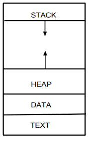

# 2.1 从控制流劫持攻击讲起

CPU特性中属于计算域内的安全的绝大多数问题都是内存安全问题相关，而内存安全的主要防御目标就是内存劫持攻击。内存劫持攻击即`Control-Flow Hijacking Attack`，而防御技术一般称作`CFI(Control-Flow Integrity)`。

!!! Note
    Google给出的定义可以供参考：

    Control-flow hijacking attacks allow an attacker to subvert a value that is loaded into the program counter of a running program, typically redirecting execution to his own injected code.

### 控制流是什么

所谓控制流，在CPU中其实就是Program Counter，即指向当前CPU执行代码的指针变化所构成的一个流。控制流劫持攻击，就是PC的值被攻击者控制了，使CPU执行的指令不同于本来程序的变成人员的预期，而按照攻击者的设计执行指令。多数情况下，这种劫持是持久的（攻击者会利用一些方式获得稳定的控制），因此攻击者多数情况下都会获得`任意代码执行`的能力。

作为表象，一个程序的功能会完全被攻击者控制。例如本来是一个读入`.mp3`文件并播放音频的程序，读入了攻击者提供的MP3文件，却弹出一个对话框问你要不要看点刺激的，

[>>>点击这里<<<](https://www.bilibili.com/video/BV1va411w7aM/?vd_source=6fb8a3b215292b6f556641fdd6e19db5)

然后你还在犹豫他就给你打开了刺激的视频！**（请勿在工作场合打开，作者关心您的个人声誉。）**。

### 最简单的控制流劫持——栈溢出攻击

#### 什么是栈

todo：这里还可以写得更加简单易懂，待有时间更新一版。

为了理解为什么会发生如此诡异的事情，我们要理解计算机是如何把一条条指令串联起来的。首先有一个概念叫做：

!!! Note
    [**冯·诺伊曼结构（Von Neumann architecture）**](https://zh.wikipedia.org/zh-cn/%E5%86%AF%C2%B7%E8%AF%BA%E4%BC%8A%E6%9B%BC%E7%BB%93%E6%9E%84)，是一种将程序指令存储器和数据存储器合并在一起的电脑设计概念结构。

不严格的来说，目前商业CPU基本上都可以看做是符合该结构的，即数据、代码都是等价地被放到内存中。为了解释内存攻击，我们需要更加接近CPU的工作方式，这里引入一个新的，更接近CPU逻辑的比喻更加方便：

CPU就像一个只会做有限个操作的机器人，而内存就像一个巨大的草稿本。草稿本上每一行都写了数据或者是简单的指令（例如：把第1行和第二行的数据加起来写到第三行）。我们只需要在草稿本上给机器人一个起点（第1页第1行），他就会照着草稿本上写得内容一行接一行执行下去。

!!! Note
    概念  | 类比
    -----|:-----
    CPU  | 只会有限个操作的机器人
    内存 | 机器人面前的一个草稿本
    指令 | 写在草稿本上，告诉机器人要做什么（这就是为啥它叫指令）
    数据 | 要处理的数据也是写在草稿本中数字

比如，我们给第1页写上：

!!! 第1页 
    **程序：计算饮料总价**
    
    行数|指令/数据
    ---|---
    1| 把第2页的第1行的数字乘以2写到第2页第2行
    2| 把第2页第2行的数字加上3写到第2页第3行

!!! 第2页
    行数|指令/数据
    ---|---
    1| 5 （瓶饮料）

这样我们就有了一个把第2页第1行的数字乘以2加上3的程序了！例如，它计算了我们买n瓶单价2块钱的饮料加上邮费（3块钱）的总价！我们可以把饮料的单价放在第2页第1行，运行完程序，我们会得到新的第2页，在第三行我们可以看到结果。当然，他一般不会记录单位。

!!! 第2页
    行数|指令/数据
    ---|---
    1| 5 （瓶饮料）
    2| 10 （元）
    3| 13 （元）

后面我们省略这一页。

很明显每次软件要CPU做的事情肯定是不一样的，如果机器人只会一行接一行的运行计算指令，那么它是无法完成复杂的功能的，因此我们需要**跳转指令/分支指令**：比如“做到这里，接下来去第1页第1行接着工作。”有时候还会判断一下条件，即**条件跳转/条件分支**：比如“如果上一行是0，那么去第1页第1行，否则继续下一行。”这样，我们就可以把*将一个数字乘以2加上3*的功能（称为一个**函数**）写到第1页第1行了，每次想使用它都写上跳转过去。

!!! Comment
    其实，有了计算和跳转功能，就可以构造[图灵机](https://zh.wikipedia.org/wiki/%E5%9B%BE%E7%81%B5%E6%9C%BA)，满足[图灵完备](https://zh.wikipedia.org/wiki/%E5%9C%96%E9%9D%88%E5%AE%8C%E5%82%99%E6%80%A7)了。我们所有无论多么高大上的编程模型，本质上其实都是此类计算和跳转完成的，我们这里不展开了。

但是问题又来了，**当机器人执行完第1页的第2行，结束了，接下来到哪里去呢？**因为我们可能在第三页跳转过来执行，还可能在第四页跳过来执行，一般情况下，执行完这个函数，我们应该回到跳转过来的地方继续执行\*。机器人自己是没有多少记忆力的，所以我们会在这个函数的最后一行写上“滚回去继续”，就是**返回指令**。而这个返回指令，其实也是一种特殊的跳转，它只是要求在跳转到这个函数之前（比如跳转指令第4页第3行），把本来下一行的位置（也就是**返回地址**，比如第4页第4行）记到另一块草稿纸上，比如写到第5页。这种需要记录当前位置的跳转指令也叫做**调用（函数的）指令**。那么现在变成了：

!!! 第4页
    **程序：结算订单**

    行数|指令/数据
    ---|---
    1| **从这里开始执行**
    2| 把本子交给用户，让用户把买的饮料数量写在第2页第1行
    3| 调用指令（函数位于第1页第1行），同时把“第4页第4行”写到第5页最新的空行
    4| 打印小票……

!!! 第1页
    **函数：计算饮料总价**

    行数|指令/数据
    ---|---
    1| 把第2页的第1行的数字乘以2写到第2页第3行
    2| 把第2页第3行的数字加上3写到第2页第4行
    3| **返回指令（去第五页找到最新的地址跳回去）**

!!! 第5页
    行数|指令/数据
    ---|---
    1| 第4页第4行  <--最新的空行 调用指令写的，返回指令读

这样，从第4页第3行调用指令跳转过来时候，就会回到第4页第4行继续。用完第5页第1行他会标记这行为空。

!!! Comment
    \* 这里为什么应该回到跳转过来的地方继续，或许要理解函数概念才比较直观。我们希望函数是一个重复功能，每次调用之后就代替写一段固定指令。所以我们希望他结束了就简简单单继续（比如去打印小票）就好了。但是这个似乎很显然的点，也并不是永远成立，有时候其他编程范式就不会回到调用点继续。

当然，一个函数里我们肯定希望还能更进一步调用其他函数来增加复杂度。例如，我们可能乘以2这个操作中的2，可能是每瓶饮料的单价，其实它会浮动，可能下个月是2.5了。我们就会把这个功能单独写成函数，以便情况下也需要这个单价。代码变成了：

!!! 第1页
    **函数：计算饮料总价**

    行数|指令/数据
    ---|---
    1| 调用指令 （**查询今天饮料单价**）把下一行“第1页第2行”加到第五页上最新空行上
    2| 拿到上一行的结果，把第2页的第1行的数字乘以它写到第2页第3行
    3| 把第2页第3行的数字加上3写到第2页第4行
    4| 返回指令（去第五页找到最下面的地址跳过去）

!!! 第5页
    行数|指令/数据
    ---|---
    1| 第4页第4行  <--**结算订单** 调用 **计算饮料总价**时记的
    2| 第1页第2行  <--**计算饮料总价** 调用 **查询今天饮料单价**时记的

这样，你会发现其实第5页被我们记了两次，第一个是从其他位置调用第1页函数记的来源地址，第二个是我们新加的第1行写下的（第1页第2行），所以我们之前写得是“找到第五页最新的地址”。当“查询今天饮料单价的函数”返回时，他就会找到最新的地址返回，来保证程序流程还是正确的。我们发现，这个第五页其实是根据调用的层次变长的，而每次返回都用的是最新写入的。所以这是一个经典的**“栈结构”**——后入先出。这也就是我们为什么的内存布局中需要一个栈空间（Stack）。

实际上，在内存里，栈是向低地址延伸的。所以我们把第5页稍微反过来画：

!!! 第5页
    行数|指令/数据
    ---|---
    ……|……
    99| 第1页第2行  <--**计算饮料总价** 调用 **查询今天饮料单价**时记的
    100| 第4页第4行  <--**结算订单** 调用 **计算饮料总价**时记的
    ……|……
    

更进一步，我们发现，调用函数的时候总是需要一些参数（否则我们可以直接得到固定值了）和中间变量。我们其实可以把这些参数值和函数的计算结果也放到栈上。这样有两个好处：

+ 出现递归/嵌套调用的时候（比如有个函数叫做**添加一层包装**，那它可能对一些有过包装的东西再包装一次），参数不会都写在一处互相打架
+ 不同的CPU同时使用同一份代码时参数不会写在一处打架，他们都有自己的栈

那么现在函数是这样的：

!!! 第4页
    **程序：结算订单**

    行数|指令/数据
    ---|---
    1| **从这里开始执行**
    2| 把本子交给用户，让用户把买的饮料数量写在第5页最新一行
    3| 调用指令（函数位于第1页第1行），同时把“第4页第4行”写到第5页最新的空行
    4| 打印小票……

!!! 第1页
    **函数：计算饮料总价**

    行数|指令/数据
    ---|---
    1| 把第五页上第二新的数据拿出来（最新的是返回地址），作为输入a
    2| 调用指令 （**查询今天饮料单价**）把下一行“第1页第2行”加到第五页上最新空行上
    3| 从第五页上最新的数据拿到上一行的结果b，a乘以它写到第五页上最新的一行（叫做c）
    4| 把c加上3，写到第五页上当时拿到输入a的地方
    5| 把临时弄乱的第5页的内容恢复回去，只剩来源地址
    6| 返回指令（去第五页找到最下面的地址跳过去）

某一时刻，第五页是这样的

!!! 第5页
    行数|指令/数据
    ---|---
    ……|……
    97| 临时数据c
    98| 调用**查询今天饮料单价**返回的结果 b （这里省略了调用这个函数的过程）
    99| 第4页第4行  <-- **结算订单** 调用 **计算饮料总价**时记的
    100| 用户输入的购买饮料数量 也就是a 然后被**计算饮料总价** 改为他的结果
    ……|……
    

这里*最新的数据*需要一个指针来指向，当最新的数据被拿走时，它会指向次新的数据。我们不在深入，感兴趣的同学可以去查看函数调用中栈的原理。

我们可以看到，第五页现在不仅仅包括了函数调用的地址，还包括函数输入输出的数据，因为我们还有一个*最新的数据的指针*，一般它也会被放到函数的栈结构上。我们发现，栈是根据每个函数对应的，我们把每个函数对应的栈的那一小段就叫做栈帧。

[Wikipedia对调用栈的解释](https://en.wikipedia.org/wiki/Call_stack)中的图可以看到每个栈帧的内容（DrawLine是一个函数名），我们已经都介绍过了。

+ Stack Pointer: 指向最新的数据
+ Frame Pointer：用于区分不同的栈帧起始点
+ Return Address：返回地址，即从哪里调用的该函数
+ Parameters：函数用的参数
+ Locals：函数的中间变量

!!! Note
    概念  | 类比
    -----|:-----
    栈   | 用来记录当前函数调用相关信息的临时页
    栈帧 | 每层调用需要的栈的部分，一个栈帧对应一个函数的临时数据
    
当然，这些内容的排布是有设计空间的，并且CPU内也有临时的存储空间——寄存器来传递参数。这些约定俗称的规则就称为`调用惯例`，也是ABI(Application Binary Interface)的一部分。

!!! Comment
    这种讲述方式我希望读者有这样一个收益：*我能够从设计的角度，为什么需要设计这样的结构*。而不是*我知道这个结构是可以work的*。这个区别会很大程度上影响对问题认知的程度。

#### 接下来，溢出它！

我们看到，函数内部的一些临时变量也在这个运行时栈中。假设我们做一个小小的变化：我们让第一页的函数自己找用户直接写入用户姓名和饮料数量。这时候，CPU看到这样一个指令：

!!! 第1页
    **函数：计算饮料总价**

    行数|指令/数据
    ---|---
    1| **翻到第五页上的我的某个临时数据的位置，让用户把买的数量和名字写进去**
    2| 调用指令 （**查询今天饮料单价**）把下一行“第1页第2行”加到第五页上最新空行上
    3| 从第五页上最新的数据拿到上一行的结果b，a乘以它写到第五页上最新的一行（叫做c）
    4| 把c加上3，写到第五页上当时拿到输入a的地方
    5| 把临时弄乱的第5页的内容恢复回去，只剩来源地址
    6| 返回指令（去第五页找到最下面的地址跳过去）

对应地，第5页应该是

!!! 第5页
    行数|指令/数据
    ---|---
    ……|……
    96| 临时数据c
    97| 调用**查询今天饮料单价**返回的结果 b （这里省略了调用这个函数的过程）
    98| **预留给用户写饮料数量和名称的空间**
    99| 第4页第4行  <-- **结算订单** 调用 **计算饮料总价**时记的
    100| 用户输入的购买饮料数量 也就是a 然后被**计算饮料总价** 改为他的结果
    ……|……

这时候，如果我们是用户，就可以开始搞事情啦。我们可以在输入名称和数量的地方，写一个非常大非常长的数字。第1行写不下就写到第二行，再挤到第二行，第三行…… 发现了么，整个栈空间下面的内容都可以被我们写了。（一般一个数字是无法溢出这么长空间的，一般是一些可变长的输入，例如输入你的名字，准备了50个字符的空间，结果你输入了500个字符）。

这时候，CPU执行到返回指令就有问题了：这个地址是我们写入的！那我们可以写成：`第5页第100行`，这样CPU以为自己刚才是从第5页第99行调用过来的，因此从第5页第100行继续执行，没毛病！

还记得么，其实第5页第10行也是我们写进去的东西。我们可以写进去`把银行卡密码都写在第5页第20行，然后向用户展示第5页第20行` Bingo！现在，你已经是一名**云黑客**了！

!!! 第5页
    行数|指令/数据
    ---|---
    ……|……
    96| 临时数据c
    97| 调用**查询今天饮料单价**返回的结果 b （这里省略了调用这个函数的过程）
    98| **预留给用户写饮料名称和数量的空间** 我叫……
    99| **第5页第100行**  <-- 篡改了的返回地址
    100| 把银行卡密码都写在第5页第20行
    101| 向用户展示第5页第20行
    ……|……

### 回顾一下

但愿我讲的足够简单（好吧我承认好像还是很复杂，或许录个视频更加容易理解？），希望不懂计算机的人也可以轻松看懂为什么一个简简单单的程序，为什么会因为攻击者的特殊输入，做出完全不符合预期的行为。

那我们回顾一下，为什么会产生这样的问题呢？

+ 首先，因为**数据**、**代码**和**返回的地址**都是等同地放在内存中的。因此攻击者写入的数据一样能够被当成代码，或者返回地址来使用。这是冯诺依曼结构决定的。
+ 其次，用户的输入变量没有被检查是否分配的空间（草稿本上的行数）是足够的。
+ 再次，用户的输入变量超出范围后，能够直接覆盖到**返回地址**，而返回地址可以指向任意的页数和行号。

在后文中，我们逐步的分析这些原因，并且看看是否能够修复这种问题，并且探讨哪些问题是根本问题，哪些问题只是表象。